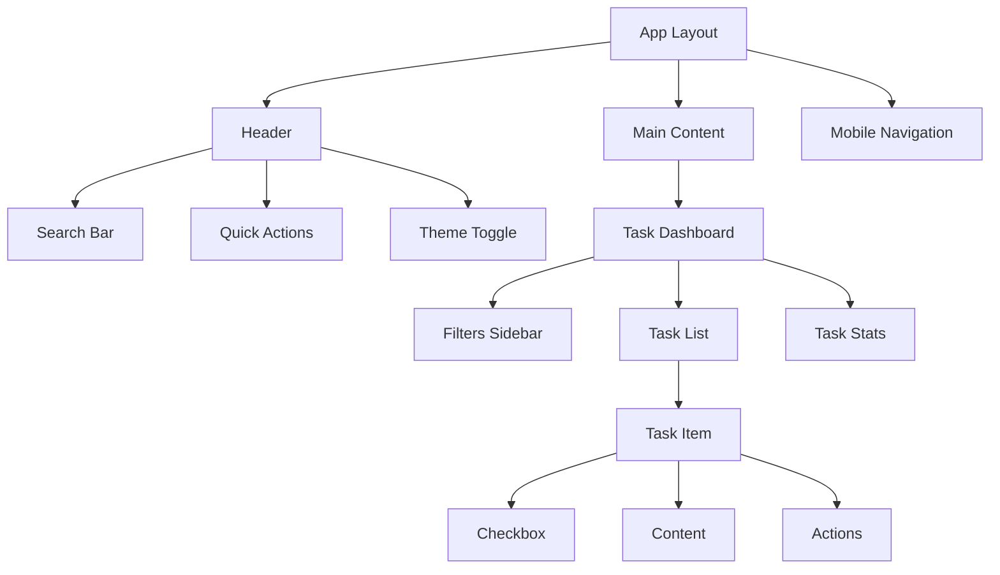
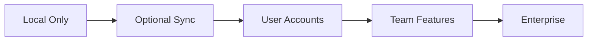

# TaskFlow Architecture Document

## Executive Summary

TaskFlow is a local-first, progressive web application built with Next.js 14, designed to provide instant, offline-capable task management without authentication overhead. The architecture prioritizes client-side performance, data persistence through IndexedDB, and a delightful user experience through modern React patterns and optimistic UI updates.

## System Overview

### Architecture Style
- **Pattern**: Client-side MVC with local-first data
- **Deployment**: Static site with client-side rendering
- **Data Strategy**: Browser-based storage with export/import capabilities
- **State Management**: Client-side state with persistence layer

### Key Architectural Decisions
1. **Local-First**: All data operations happen client-side for instant feedback
2. **No Backend**: Eliminates complexity, latency, and authentication requirements
3. **Progressive Enhancement**: Core functionality works everywhere, enhanced features for modern browsers
4. **Component-Driven**: Modular, reusable UI components with shadcn/ui
5. **Type-Safe**: Full TypeScript coverage for reliability

## Technology Stack

### Frontend Core
- **Framework**: Next.js 14.2 (App Router)
- **Language**: TypeScript 5.3
- **Runtime**: React 18.3
- **Styling**: Tailwind CSS 3.4

### UI Components
- **Component Library**: shadcn/ui (latest)
- **Icons**: Lucide React
- **Animations**: Framer Motion 11
- **Charts**: Recharts 2.10

### State & Data Management
- **Local State**: Zustand 4.5
- **Persistence**: Dexie.js 4.0 (IndexedDB wrapper)
- **Validation**: Zod 3.22
- **Date Handling**: date-fns 3.0

### Development Tools
- **Build**: Turbopack (Next.js built-in)
- **Linting**: ESLint 8 + Prettier 3
- **Testing**: Vitest 1.2 + Testing Library
- **E2E Testing**: Playwright 1.41

### Deployment & Monitoring
- **Hosting**: Vercel / Netlify / GitHub Pages
- **Analytics**: Vercel Analytics (privacy-friendly)
- **Error Tracking**: Client-side error boundary
- **Performance**: Web Vitals monitoring

## Component Architecture

### Directory Structure
```
app/
├── (marketing)/           # Marketing pages
│   ├── page.tsx          # Landing page
│   └── layout.tsx
├── (app)/                # Main application
│   ├── layout.tsx        # App shell
│   ├── page.tsx          # Task dashboard
│   ├── settings/         # Settings page
│   └── stats/            # Statistics page
├── api/                  # API routes (if needed)
└── test/                 # Test routes for development

components/
├── ui/                   # shadcn/ui components
├── tasks/               # Task-specific components
│   ├── task-item.tsx
│   ├── task-list.tsx
│   ├── task-form.tsx
│   └── task-filters.tsx
├── layout/              # Layout components
│   ├── header.tsx
│   ├── sidebar.tsx
│   └── mobile-nav.tsx
└── shared/              # Shared components
    ├── theme-toggle.tsx
    └── keyboard-shortcuts.tsx

lib/
├── db/                  # Database layer
│   ├── schema.ts        # TypeScript schemas
│   ├── db.ts           # Dexie instance
│   └── migrations.ts    # Schema migrations
├── stores/              # Zustand stores
│   ├── task-store.ts
│   ├── ui-store.ts
│   └── settings-store.ts
├── hooks/               # Custom React hooks
│   ├── use-tasks.ts
│   ├── use-filters.ts
│   └── use-keyboard.ts
└── utils/               # Utility functions
    ├── export.ts        # Export functionality
    ├── import.ts        # Import functionality
    └── validators.ts    # Zod schemas
```

### Component Hierarchy


## Data Architecture

### Client-Side Database Schema

```typescript
// lib/db/schema.ts
interface Task {
  id: string;                    // UUID v4
  title: string;                  // Required, max 200 chars
  description?: string;           // Optional, max 2000 chars
  categoryId?: string;            // Foreign key to Category
  priority: 'low' | 'medium' | 'high';
  dueDate?: Date;                 // Optional due date
  completed: boolean;             // Completion status
  completedAt?: Date;             // When completed
  createdAt: Date;                // Creation timestamp
  updatedAt: Date;                // Last update
  position: number;               // For manual sorting
  deleted?: boolean;              // Soft delete flag
  deletedAt?: Date;              // Deletion timestamp
}

interface Category {
  id: string;                     // UUID v4
  name: string;                   // Max 50 chars
  color: string;                  // Hex color code
  icon?: string;                  // Optional icon name
  position: number;               // Display order
  createdAt: Date;
  updatedAt: Date;
}

interface Settings {
  theme: 'light' | 'dark' | 'system';
  defaultView: 'list' | 'board' | 'calendar';
  defaultSort: 'position' | 'dueDate' | 'priority' | 'createdAt';
  showCompleted: boolean;
  soundEnabled: boolean;
  notificationsEnabled: boolean;
  keyboardShortcutsEnabled: boolean;
}
```

### IndexedDB Structure
```typescript
// lib/db/db.ts
import Dexie, { Table } from 'dexie';

class TaskFlowDB extends Dexie {
  tasks!: Table<Task>;
  categories!: Table<Category>;
  settings!: Table<Settings>;

  constructor() {
    super('TaskFlowDB');
    this.version(1).stores({
      tasks: '++id, categoryId, priority, dueDate, completed, createdAt',
      categories: '++id, position',
      settings: '++id'
    });
  }
}
```

### State Management Architecture

```typescript
// lib/stores/task-store.ts
interface TaskStore {
  // State
  tasks: Task[];
  categories: Category[];
  filters: TaskFilters;
  
  // Actions
  addTask: (task: Partial<Task>) => Promise<void>;
  updateTask: (id: string, updates: Partial<Task>) => Promise<void>;
  deleteTask: (id: string) => Promise<void>;
  toggleTask: (id: string) => Promise<void>;
  
  // Bulk operations
  importTasks: (data: ImportData) => Promise<void>;
  exportTasks: (format: 'json' | 'csv' | 'markdown') => Promise<Blob>;
  clearAllTasks: () => Promise<void>;
  
  // Computed values
  getFilteredTasks: () => Task[];
  getTasksByCategory: (categoryId: string) => Task[];
  getOverdueTasks: () => Task[];
}
```

## Security Architecture

### Client-Side Security Measures
1. **Input Sanitization**: All user inputs sanitized before storage
2. **XSS Prevention**: React's built-in XSS protection + Content Security Policy
3. **Data Validation**: Zod schemas for all data operations
4. **Export Security**: Sanitized exports to prevent injection attacks
5. **Local Storage Encryption**: Optional encryption for sensitive data

### Content Security Policy
```javascript
// next.config.js
const cspHeader = `
    default-src 'self';
    script-src 'self' 'unsafe-eval' 'unsafe-inline';
    style-src 'self' 'unsafe-inline';
    img-src 'self' blob: data:;
    font-src 'self' data:;
    object-src 'none';
    base-uri 'self';
    form-action 'self';
    frame-ancestors 'none';
    upgrade-insecure-requests;
`
```

## Performance Architecture

### Optimization Strategies

#### 1. Code Splitting
```typescript
// Lazy load heavy components
const StatsView = lazy(() => import('./components/stats/StatsView'));
const ExportDialog = lazy(() => import('./components/dialogs/ExportDialog'));
```

#### 2. Virtual Scrolling
```typescript
// For large task lists
import { VirtualList } from '@tanstack/react-virtual';
```

#### 3. Optimistic Updates
```typescript
// Immediate UI feedback
const optimisticUpdate = async (taskId: string) => {
  // Update UI immediately
  setTasks(prev => updateTaskInList(prev, taskId));
  
  // Persist to database
  try {
    await db.tasks.update(taskId, changes);
  } catch (error) {
    // Rollback on failure
    setTasks(prev => rollbackTask(prev, taskId));
  }
};
```

#### 4. Service Worker & PWA
```javascript
// public/sw.js
self.addEventListener('install', (event) => {
  event.waitUntil(
    caches.open('taskflow-v1').then((cache) => {
      return cache.addAll([
        '/',
        '/offline.html',
        '/manifest.json'
      ]);
    })
  );
});
```

### Performance Budgets
- **First Contentful Paint**: < 1.2s
- **Largest Contentful Paint**: < 2.5s
- **Time to Interactive**: < 3.5s
- **Cumulative Layout Shift**: < 0.1
- **First Input Delay**: < 100ms
- **Bundle Size**: < 200KB (gzipped)

## User Interface Architecture

### Design System

#### Color Palette
```css
:root {
  --primary: #3B82F6;      /* Blue */
  --primary-dark: #2563EB;
  --success: #10B981;      /* Green */
  --warning: #F59E0B;      /* Amber */
  --error: #EF4444;        /* Red */
  --gray-50: #F9FAFB;
  --gray-900: #111827;
}
```

#### Typography Scale
```css
--text-xs: 0.75rem;    /* 12px */
--text-sm: 0.875rem;   /* 14px */
--text-base: 1rem;     /* 16px */
--text-lg: 1.125rem;   /* 18px */
--text-xl: 1.25rem;    /* 20px */
--text-2xl: 1.5rem;    /* 24px */
```

#### Spacing System
```css
--space-1: 0.25rem;    /* 4px */
--space-2: 0.5rem;     /* 8px */
--space-3: 0.75rem;    /* 12px */
--space-4: 1rem;       /* 16px */
--space-6: 1.5rem;     /* 24px */
--space-8: 2rem;       /* 32px */
```

### Responsive Breakpoints
```css
--mobile: 640px;
--tablet: 768px;
--desktop: 1024px;
--wide: 1280px;
```

## Testing Architecture

### Testing Strategy

#### Unit Tests (70%)
```typescript
// lib/utils/__tests__/validators.test.ts
describe('Task Validator', () => {
  it('should validate task title', () => {
    const result = taskSchema.safeParse({ title: '' });
    expect(result.success).toBe(false);
  });
});
```

#### Integration Tests (20%)
```typescript
// components/__tests__/TaskList.test.tsx
describe('TaskList Component', () => {
  it('should render tasks from store', async () => {
    render(<TaskList />);
    await waitFor(() => {
      expect(screen.getByText('Sample Task')).toBeInTheDocument();
    });
  });
});
```

#### E2E Tests (10%)
```typescript
// e2e/task-flow.spec.ts
test('complete task flow', async ({ page }) => {
  await page.goto('/');
  await page.click('[data-testid="new-task"]');
  await page.fill('[name="title"]', 'Test Task');
  await page.press('[name="title"]', 'Enter');
  await expect(page.locator('text=Test Task')).toBeVisible();
});
```

## Deployment Architecture

### Build Pipeline
```yaml
# .github/workflows/deploy.yml
name: Deploy
on:
  push:
    branches: [main]
    
jobs:
  deploy:
    runs-on: ubuntu-latest
    steps:
      - uses: actions/checkout@v3
      - uses: actions/setup-node@v3
      - run: npm ci
      - run: npm run test
      - run: npm run build
      - uses: actions/upload-artifact@v3
        with:
          name: build
          path: .next
```

### Environment Configuration
```typescript
// config/env.ts
export const config = {
  isDev: process.env.NODE_ENV === 'development',
  isProd: process.env.NODE_ENV === 'production',
  isTest: process.env.NODE_ENV === 'test',
  
  app: {
    name: 'TaskFlow',
    version: process.env.NEXT_PUBLIC_APP_VERSION || '1.0.0',
    url: process.env.NEXT_PUBLIC_APP_URL || 'http://localhost:3000'
  },
  
  features: {
    enableNotifications: process.env.NEXT_PUBLIC_ENABLE_NOTIFICATIONS === 'true',
    enableAnalytics: process.env.NEXT_PUBLIC_ENABLE_ANALYTICS === 'true',
    enablePWA: process.env.NEXT_PUBLIC_ENABLE_PWA === 'true'
  }
};
```

## Monitoring & Analytics

### Client-Side Monitoring
```typescript
// lib/monitoring/analytics.ts
export const trackEvent = (event: string, properties?: Record<string, any>) => {
  if (config.features.enableAnalytics) {
    // Privacy-friendly analytics
    window.analytics?.track(event, {
      ...properties,
      timestamp: new Date().toISOString()
    });
  }
};

// Usage
trackEvent('task_created', { priority: 'high', hasDeadline: true });
```

### Error Boundary
```typescript
// app/error.tsx
export default function ErrorBoundary({
  error,
  reset
}: {
  error: Error;
  reset: () => void;
}) {
  useEffect(() => {
    // Log error to monitoring service
    console.error('Application error:', error);
  }, [error]);
  
  return (
    <div>
      <h2>Something went wrong!</h2>
      <button onClick={reset}>Try again</button>
    </div>
  );
}
```

## Migration & Evolution

### Future Considerations
1. **Cloud Sync**: Optional user accounts with end-to-end encryption
2. **Collaboration**: Real-time collaboration via WebRTC
3. **AI Features**: Smart task suggestions and natural language input
4. **Mobile Apps**: React Native apps sharing core logic
5. **Backend Services**: Optional backend for advanced features

### Migration Path to Backend


## Development Workflow

### Git Workflow
```bash
main
├── develop
│   ├── feature/task-management
│   ├── feature/search-filters
│   └── feature/data-export
└── release/v1.0.0
```

### Code Quality Standards
1. **TypeScript**: Strict mode enabled, no any types
2. **Components**: Functional components with hooks
3. **Naming**: PascalCase for components, camelCase for functions
4. **Testing**: Minimum 80% coverage for utils, 60% for components
5. **Commits**: Conventional commits (feat:, fix:, docs:, etc.)

### Performance Monitoring Checklist
- [ ] Bundle size under budget
- [ ] Lighthouse score > 95
- [ ] No memory leaks in long sessions
- [ ] Smooth animations (60fps)
- [ ] Fast task operations (<100ms)

## Risk Mitigation

### Technical Risks
| Risk | Mitigation |
|------|------------|
| Browser storage limits | Implement data archiving and cleanup |
| IndexedDB corruption | Regular exports, integrity checks |
| Performance degradation | Virtual scrolling, pagination |
| Browser compatibility | Progressive enhancement, polyfills |

### Operational Risks
| Risk | Mitigation |
|------|------------|
| Data loss | Auto-save, export reminders |
| User confusion | Onboarding flow, tooltips |
| Feature creep | Strict MVP scope |
| Technical debt | Regular refactoring sprints |

## Conclusion

TaskFlow's architecture is designed for simplicity, performance, and user delight. By focusing on local-first development with no backend dependencies, we eliminate complexity while delivering a fast, reliable task management experience. The progressive enhancement approach ensures the app works everywhere while taking advantage of modern browser capabilities where available.

---

*Architecture Version: 1.0*
*Last Updated: 2025-01-30*
*Status: Ready for Implementation*